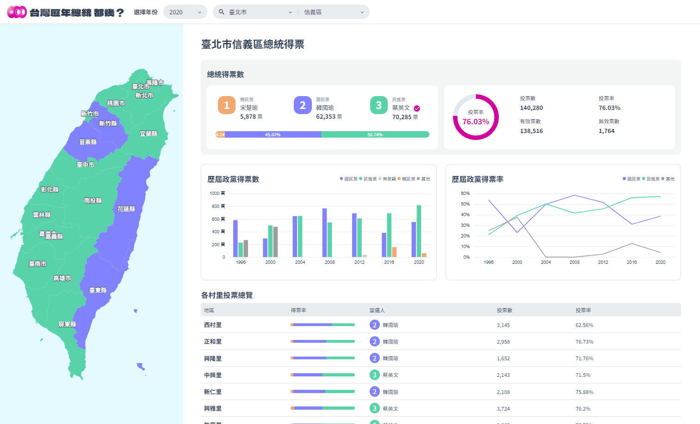
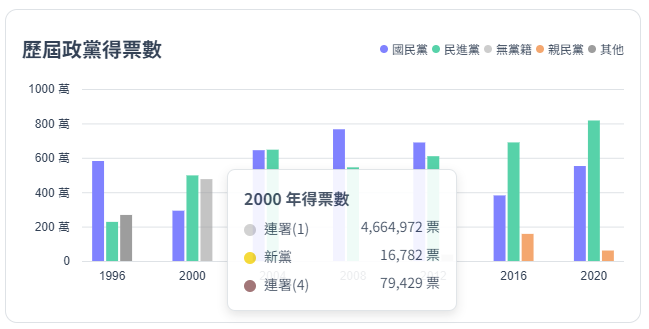

# THE F2E 2023 - 總統即時開票全台地圖

[UI 設計師：jhen](https://2023.thef2e.com/users/12061579704041679194?week=2) | [設計稿](https://www.figma.com/file/WlsKcXrmUd0lL4f8p3d122/2023-The-F2E-%E7%B8%BD%E7%B5%B1?type=design&node-id=4818-2&mode=design&t=xuqOXefpZWHck5Dm-0) | [Demo](https://imshanna.github.io/F2E_2023_Mission2/)

查詢歷年來台灣總統大選各地區投票狀況、政黨得票資料。  
練習用，邊寫邊熟悉 javascript，  
雖然趕不上投稿期限，但透過這次的主題學到很多新東西！  

## 使用技術
- 圖表、地圖：D3.js
- 資料處理：Python pandas

## 作品說明
- 台灣地圖：可縮放、平移，點擊導覽至該縣市資料
- 歷年投票資訊：可查詢 1996～2024 年，全台各縣市、鄉鎮市區、村里資料
- 可視化圖表：歷屆政黨得票總覽，hover 後顯示詳細資訊  

## 補充說明
1. 1996~2004 年的原始資料中，有出現村里名稱重複但兩筆投票數據不同的情況，故少數村里投票總覽會出現如「永樂村」、「永樂村(2)」。
2. 因台灣縣市曾改制，但網頁中的台灣地圖為 2023 年的資料，故較早年的部分：經過更名後的縣市顏色為白色，無法直接點擊導覽，且經過縣市合併前的縣市不會顯示在地圖上。

## 相關連結
[THE F2E 2023 活動官網](https://2023.thef2e.com/)