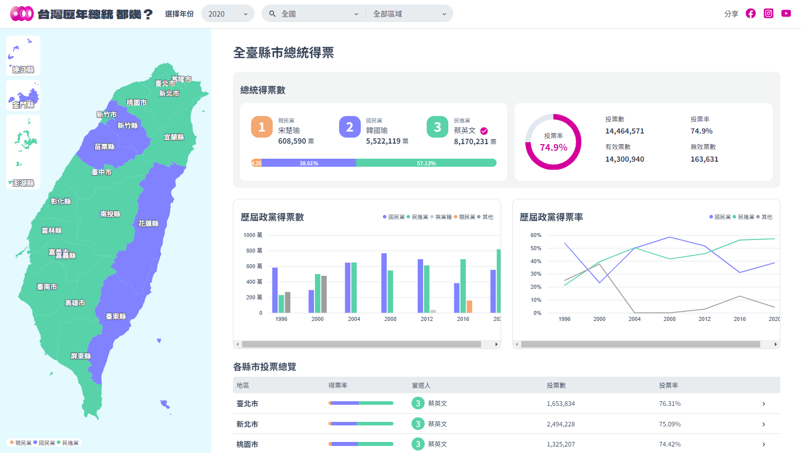

# THE F2E 2023 - 立委競選官網

[UI 設計師：jhen](https://2023.thef2e.com/users/12061579704041679194?week=2) | [設計稿](https://www.figma.com/file/WlsKcXrmUd0lL4f8p3d122/2023-The-F2E-%E7%B8%BD%E7%B5%B1?type=design&node-id=4818-2&mode=design&t=xuqOXefpZWHck5Dm-0) | [Demo](https://imshanna.github.io/F2E_2023_Mission2/)

練習用，邊寫邊熟悉 javascript  
雖然趕不上投稿期限 但透過這次的主題讓學到很多新東西！  

## 使用技術
- 圖表、地圖：D3.js
- 資料處理：Python pandas

## 作品說明
- 台灣地圖：可縮放平移、導覽至各縣市資料
- 投票資訊：可查詢全台各縣市、鄉鎮市區、村里
- 可視化圖表：歷屆政黨得票總覽，hover 顯示詳細資訊  

    
## 待辦事項
 - [ ] 補齊歷年資料
 - [ ] 地圖細節調整
 - [ ] 導覽頁
 - [ ] RWD

## 相關連結
[THE F2E 2023 活動官網](https://2023.thef2e.com/)